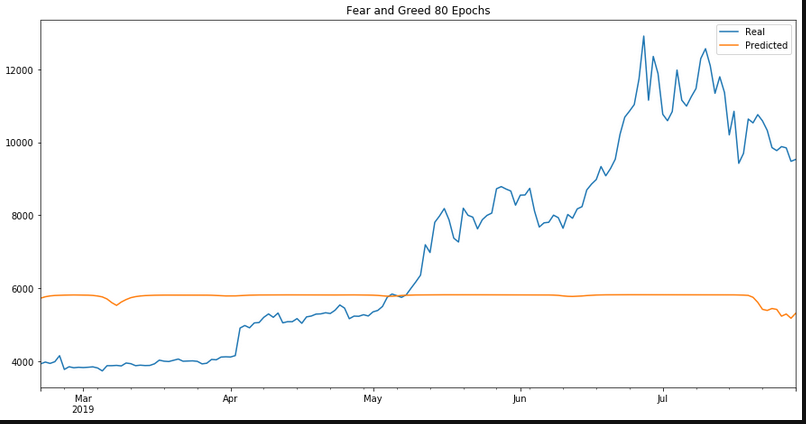

# Project

### Compare how a LSTM Neural Network model performs on various features.

## Creating a base model using Stock Prices as the Feature (X) for the model

### Notes on this model

I used code very similar to the one found in the assignments for this model. The logic was that that model style was pretty basic. The only thing I really changed about this basic model template was the number of epochs and the node amounts for each layer. I chose to increase the epochs from 10 to 80 and increased the number of hidden nodes from 5 to 20 with the aim of creating a more accurate model without adding much complexity.

### Results

This model predicts accurately enough to be considered dangerous the future values of this particular asset.

### Model 1 Conclusion

- Assumption: This model can consistently predict this accuarate.

If the assumption that this model can consistently predict values this accurate are true, then this would be the model I could feel comfortable placing bets with. This model is accurate and consistently so for the time period. There aren't any instances that I can detect where the model was wrong in at least the direction of movement. On top of that, this model can predict the extent of a movement pretty well also.

## Other versions using various epochs

Initially this model was the same as it is now with only exception being I used less epochs (10 epochs). This resulted in a very poor graph. Low suction of the prediction to the actual and washed out price movements.

Then when I upped the epochs to 80, the graph had better suction and predicted the price movement incredibly well (pretty much always right). However, though the suction was better than the last model's, it was still not as close as I would've like it to have been. So I increased the number of epochs to 160. This resulted in a much closer fit. Unfortunately, the model's ability to predict price movements got worse. Not much, but enough to cause hesitation if one were betting on this model.

### 160 Epochs vs 80 Epochs

I would personally prefer to have a model that predicted the price movements correctly almost 100% of the time and the extent at which it predicts the price to move to be average than the opposite. In essence, I would prefer the model just before this one. I.e. the model with 80 epochs.

## Loss Function Problem

While experimenting I noticed that some of my models would have better/lower loss performance. However, that did not mean that the graph produced with these models were better than those with higher losses.

As stated above, I prefer graphs that show me prdicted price movements that mimic actual price movements over graphs that can more accurately predict what the price of a stock is going to be. This is mainly because, the difference between how accurate the model's predict price is very minimal. However, the difference between how accurate the model's predict price movement can be substantial.

Initially, I would judge how well a model did based off of the model's loss. After some time running models though, I ended up looking at the loss function as a rough estimate of how the model **might** perform.

# Using the same model with different features

I then used that exact same model with a different feature input (Fear and Greed Value). The result was that this model did exceptionally poorly.

## Understanding Why the Second Model Performed So Poorly

I then tried to reason why that might be the case. I decided to test the correlation between the Fear and Greed Value with the actual value of Bitcoin over the years. I wanted to see if a change in a F & G value had anything to with a change in the value of Bitcoin. As it turns out, they have very little correlation of 0.046. My assumption from this test is that the features used in an LSTM NN Model might be randomly chosen, but they must have some relation to the target values (y). In other words, the user can choose random features because they have no idea how it will impact the model's output, but those features might need to actually be correlated with the target values of the model to actually improve the model's performance.
