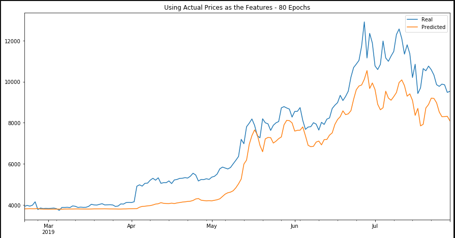

# Project
### Compare how a LSTM Neural Network model performs on various features.

## Test
In the first situation, I used an LSTM Neural Network Model to predict the value of Bitcoin using Bitcoin itself as the feature for the model. Through some tweaking, I got the model to predict both the price movement and the actual value of the asset reasonably well.

I then used that exact same model with a different feature input (Fear and Greed Value). The result was that this model did exceptionally poorly. 

## Understanding Why the Second Model Performed So Poorly
I then tried to reason why that might be the case. I decided to test the correlation between the Fear and Greed Value with the actual value of Bitcoin over the years. I wanted to see if a change in a F & G value had anything to with a change in the value of Bitcoin. As it turns out, they have very little correlation of 0.046. My assumption from this test is that the features used in an LSTM NN Model might be randomly chosen, but they must have some relation to the target values (y). In other words, the user can choose random features because they have no idea how it will impact the model's output, but those features might need to actually be correlated with the target values of the model to actually improve the model's performance.
